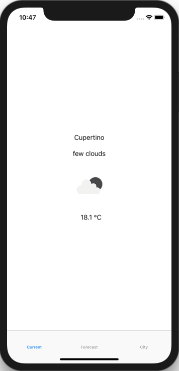
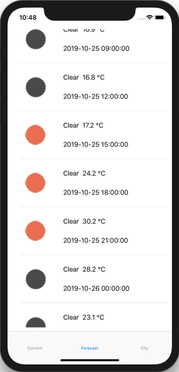
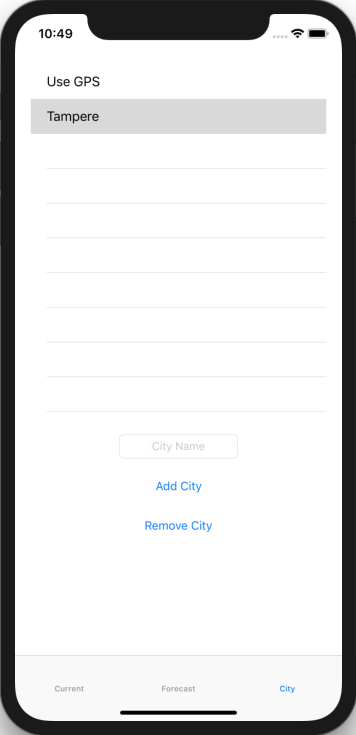

# Weather-App

A Simple ios App that fecthes weather data from openweathermap.org and displays them.

## Table of contents

* [General info](#general-info)
* [Technologies](#technologies)
* [Features](#features)

## General info

A Simple ios App that fecthes weather data from openweathermap.org and displays them.
User can view fecthed data as what is current weather in that area and 5 Day forecast which have 3 hours between every data.
User can select does app fetch weather data by gps or by City name. User can add and delete cities.

## Technologies

* XCode - version 10.1
* Swift - version 4.2.1

## Features

* Current weather

* Forecast 5Day/3Hour

* Select City

## Status

Project is: finished
